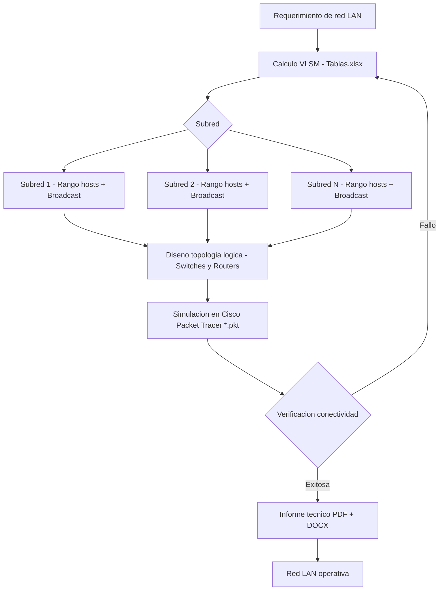

# Direccionamiento Red LAN — VLSM

> Diseño y segmentación de red LAN con VLSM simulada en Cisco Packet Tracer.

## Descripción

---

Proyecto de diseño de infraestructura de red de área local aplicando **Variable Length Subnet Masking (VLSM)** para una segmentación eficiente del espacio de direccionamiento IPv4. Incluye tablas de subredes, plan de direccionamiento completo y simulación del esquema en **Cisco Packet Tracer**.

## Contenido del repositorio

| Archivo | Descripción |
|---|---|
| `*.pkt` | Topología de red en Cisco Packet Tracer |
| `Tablas.xlsx` | Plan de direccionamiento VLSM |
| `*.pdf` | Informe técnico con análisis de la segmentación |
| `*.docx` | Desarrollo detallado del laboratorio |

## Conceptos aplicados

- Subnetting con VLSM para optimización del espacio de direcciones
- Cálculo de rangos de host, broadcast y máscara por subred
- Topología lógica de red LAN con switches y routers
- Verificación de conectividad entre subredes

## Contexto académico

**Asignatura:** Redes de Computadores · **Institución:** Ingeniería Informática
**Autor:** Alejandro De Mendoza — Ingeniero Informático · Máster Arquitectura de Software

---

## Arquitectura

## Autor

**Alejandro De Mendoza**  
Ingeniero Informático · Especialista en IA · Especialista en Ingeniería de Software · Máster en Arquitectura de Software

